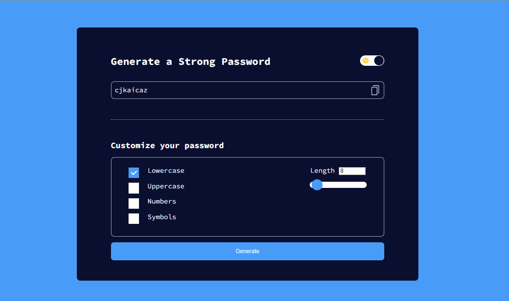

# Secure & Strong Password Generator

Generate strong and secure passwords with custom options using this simple web-based tool.

## Table of Contents

- [Introduction](#introduction)
- [Features](#features)
- [Demo](#demo)
- [Installation](#installation)
- [Usage](#usage)
- [Customization](#customization)
- [Contributing](#contributing)
- [License](#license)

## Introduction

This project is a web application designed to help users generate strong and secure passwords for various purposes. With options to customize the password's length and include lowercase, uppercase, numbers, and symbols, users can tailor their passwords to meet specific requirements.



## Features

- Generate strong and secure passwords.
- Customize password length and character types.
- Dark mode for better user experience.
- Copy generated passwords to clipboard easily.

## Demo

Click [here](https://gmpsankalpa.github.io/password-generator) to view demo.

## Installation

1. Clone the repository:

   ```bash
   git clone https://github.com/gmpsankalpa/Password-Generator.git

2. Navigate to the project directory:

   ```bash
   cd Password-Generator

3. Open the `index.html` file in your web browser, and the application will be ready to use.

## Usage

1. Open the `index.html` file in your web browser.
2. Customize your password preferences using the checkboxes and slider.
3. Click on the "Generate" button to generate a password.
4. Copy the generated password by clicking on the copy icon next to it.

## Customization

- **Length**: Adjust the length of the generated password by using the slider or input field.
- **Character Types**: Select which character types to include in the generated password (lowercase, uppercase, numbers, symbols) by checking or unchecking the corresponding checkboxes.

## Contributing

Contributions to this project are welcome. If you have any suggestions for improvements or find any issues, feel free to open an issue or submit a pull request.

1. Fork the repository.
2. Create your feature branch (`git checkout -b feature/YourFeature`).
3. Commit your changes (`git commit -am 'Add some feature'`).
4. Push to the branch (`git push origin feature/YourFeature`).
5. Open a pull request.

## License

This project is licensed under the [MIT License](LICENSE).

---

<div align="center">

   
   
   
   

</div>